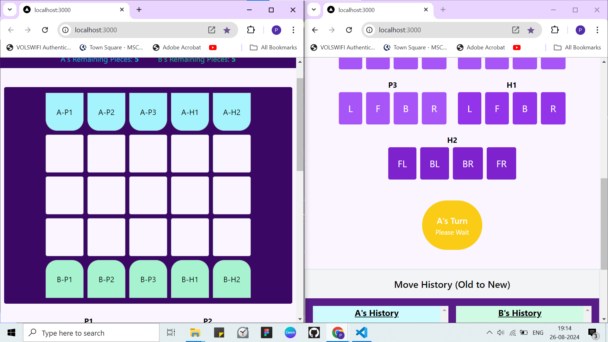

#### Clash Of Chess

- Hey, I am Pranay, and this is an assignment for HitWicket
- My task is to create a chess-like game, on the web, with websockets.
- To tell you in short words, imagine a chess and then we'll keep removing and adding stuff to get to my game.
- The grid is 5x5. There are 5 pieces on each side. Out of those 5, there are 3 Pawns and 2 Heroes.
- Pawns move Left Right Forward Backward, one step per move. Hero1 moves same directions as Pawns but 2 steps per move instead of 1. Hero2 moves diagonally, so forward-left, forward-right, backward-left, backward-right.
- The game ends when any player loses all 5 pieces.

##### How I made it ?

- I used Next.js for this. Coz it's a fullstack framework, and I have been using this for past few weeks for the project I'm doing at my internship.
- I used websocket to setup a server in Next.js and created an interface to communicate by the sockets
- I created separate states for handling game joining, ready state, moves, board, history etc.
- I then sent events from user interactions to the websocket server with the message and data, then server handles the logic, updates the states and sends it to the frontend. Then at the frontend, I update the states by listening to websocket events from server.
- This interaction forms the basic of my application that enables seamless communication and helps user smoothly play the game of "Clash Of Chess".

##### How can you run this ?

- So, first just clone my repo using git clone https://github.com/arey-pranay/PranayParikh_21BCE2962_chessGame.git .
- Then install the node_modules (npm i)
- npm install -g nodemon (if not already having it)
- Then first start the server from the root directory by nodemon server.js
- And finally start the frontend by using "npm run dev"
- You can also refer the video in case of any queries.

##### Future Scope (Original Ideas)

Since I have my exams going on rn, I couldn't implement a lot of things that I wanted to, so here are few of the stuff that I'd love to add:

- First of all, I wanna implement keyboard controls in this, like click on the piece and then use the arrow button to move, this is my foremost plan.

- Then I also wanna add a timer like chess, where the player whose timer runs out

- I also wanna add an undo option so that the player can undo there move ( a limited number of time ) before the opponent plays his/her move.

- I can implement the states more efficiently
